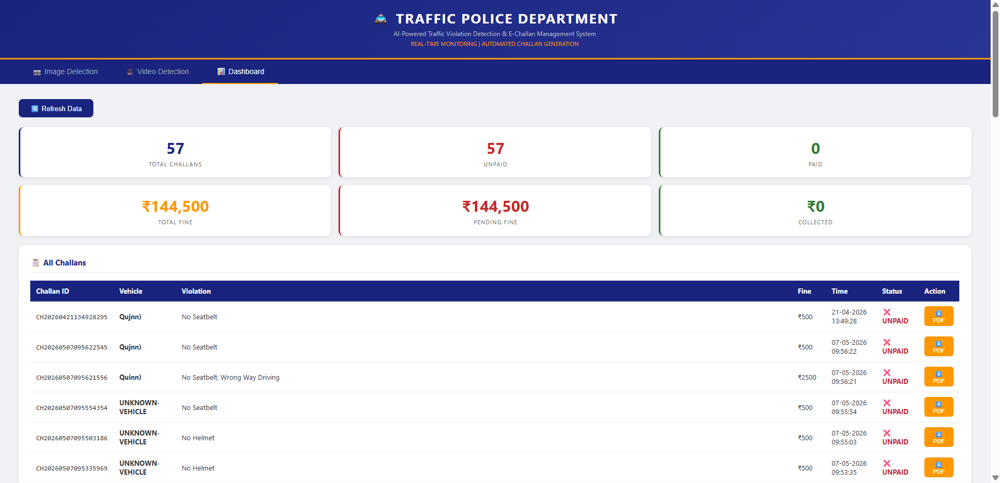
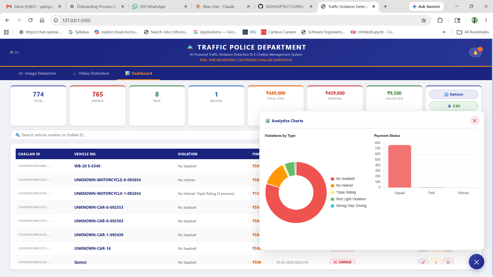

# 🚔 Traffic Violation Detection & E-Challan Generation System

> An AI-powered system that automatically detects traffic violations from images and videos, identifies vehicles, reads number plates using OCR, and generates official digital challans (PDF) — all through a web-based dashboard.


---

## 📌 Project Overview

This is a **College Major Project** that combines computer vision, deep learning, and web development to build a real-world traffic enforcement system. The system processes any traffic image or video, detects violations **per vehicle independently**, and automatically generates PDF challans stored in a database with a full management dashboard.

---

## ✨ Features

### 📷 From Images
| Feature | Description |
|---|---|
| Vehicle Detection | Detects car, motorcycle, bus, truck using YOLOv8 COCO |
| Person Detection | Counts persons in scene |
| Helmet / No Helmet | Custom trained model — detects per bike rider |
| Seatbelt Detection | Custom trained model — detects missing seatbelt in cars |
| Triple Riding | Detects 3+ persons on motorcycle |
| Number Plate OCR | Detects plate region + reads text using EasyOCR |
| Per-Vehicle Challan | Each vehicle gets its own challan independently |
| Auto PDF Generation | Challan PDF generated automatically on violation |

### 🎥 From Videos
All image features **plus:**
| Feature | Description |
|---|---|
| Speed Detection | Line-crossing method — FPS adaptive |
| Red Light Violation | YOLO traffic light + HSV color detection |
| Wrong Way Detection | Vehicle direction tracking via position history |
| No Parking Detection | Zone-based with time threshold (5 seconds) |
| Annotated Video Output | Full annotated video with bounding boxes |
| Multiple Challans | Separate challan per vehicle per video |

### 📊 Dashboard
| Feature | Description |
|---|---|
| Stats Cards | Total / Unpaid / Paid / Waived / Total Fine / Pending / Collected |
| Auto Refresh | Dashboard refreshes every 30 seconds automatically |
| Search | Search by vehicle number or challan ID |
| Filter | Filter by All / Unpaid / Paid / Waived |
| Update Status | Mark as Paid / Waived with payment mode |
| Payment Modes | Cash / Online / UPI / Cheque |
| Waived Option | Mark challan as waived (maaf) with remarks |
| Remarks | Add notes to any challan |
| Delete Challan | Remove any challan record |
| Export CSV | Download all records as CSV file |
| Print | Print dashboard directly |
| Charts (FAB) | Collapsible charts via floating button |
| Pie Chart | Violations by type breakdown |
| Bar Chart | Payment status visualization |
| PDF Download | Download any challan PDF from dashboard |

---

## 🛠️ Tech Stack

| Category | Technology | Version |
|---|---|---|
| Language | Python | 3.12.10 |
| Object Detection | YOLOv8 (Ultralytics) | 8.4.33 |
| Computer Vision | OpenCV | 4.13 |
| OCR | EasyOCR | 1.7.2 |
| Web Framework | Flask | 3.1.3 |
| Frontend | HTML5 + CSS3 + JavaScript | — |
| Charts | Chart.js | 4.4.0 |
| Database | SQLite | Built-in |
| PDF Generation | ReportLab | 4.4.10 |
| Deep Learning | PyTorch + CUDA | 2.5.1+cu121 |

---

## 💻 Hardware Used

| Component | Specification |
|---|---|
| Laptop | HP Victus 15 Gaming |
| Processor | Intel Core i5-12450H (12th Gen, 2.00 GHz) |
| RAM | 16 GB DDR5 (3200 MT/s) |
| GPU | NVIDIA GeForce RTX 3050 Laptop (4GB VRAM) |
| Storage | 477 GB SSD |
| OS | Windows 11 Home (25H2) |
| CUDA | 13.2 |
| Python | 3.12.10 |

---

## 📁 Project Structure

```
traffic_violation_system/
├── detection/
│   ├── vehicle_detector.py      # YOLOv8 vehicle + person detection
│   ├── helmet_detector.py       # Custom helmet model
│   ├── seatbelt_detector.py     # Custom seatbelt model
│   ├── plate_detector.py        # Number plate detection + EasyOCR
│   ├── traffic_light.py         # Traffic light color detection
│   ├── wrong_way.py             # Direction tracking for wrong way
│   ├── no_parking.py            # Zone-based parking detection
│   └── triple_riding.py         # Person count on bike
├── tracking/
│   └── speed_tracker.py         # FPS-adaptive line-crossing speed
├── violation_engine/
│   └── rules.py                 # Fine rules + all violation functions
├── challan/
│   └── generator.py             # ReportLab PDF challan generation
├── database/
│   ├── models.py                # SQLite schema + table creation
│   └── db.py                    # CRUD operations
├── templates/
│   └── index.html               # Full web UI (3 tabs)
├── models/                      # Trained .pt files (not in repo)
├── datasets/                    # Training data (not in repo)
├── output/                      # Generated PDFs + videos (not in repo)
├── videos/                      # Test videos (not in repo)
├── flask_app.py                 # Main Flask application (PRIMARY)
├── main_system.py               # Standalone OpenCV detection (backup)
├── train_helmet.py              # Helmet model training script
├── train_seatbelt.py            # Seatbelt model training script
├── train_numberplate.py         # Number plate model training script
├── requirements.txt             # Python dependencies
├── README.md                    # This file
└── TECHNICAL.md                 # Full technical documentation
```

---

## ⚙️ Installation & Setup

### Step 1 — Clone the repository
```bash
git clone https://github.com/YASHGUPTA11122004/Traffic-Violation-Detection-System.git
cd Traffic-Violation-Detection-System
```

### Step 2 — Create virtual environment
```bash
python -m venv venv

# Windows
venv\Scripts\activate

# Mac/Linux
source venv/bin/activate
```

### Step 3 — Install PyTorch with CUDA
```bash
pip install torch torchvision --index-url https://download.pytorch.org/whl/cu121
```

### Step 4 — Install remaining dependencies
```bash
pip install -r requirements.txt
```

### Step 5 — Download datasets
See dataset links below. Extract to `datasets/helmet/`, `datasets/seatbelt/`, `datasets/number_plate/`.

### Step 6 — Train models
```bash
python train_helmet.py
python train_seatbelt.py
python train_numberplate.py
```

### Step 7 — Run the application
```bash
python flask_app.py
```

Open browser: **http://127.0.0.1:5000**

---

## 📦 requirements.txt

```
ultralytics==8.4.33
opencv-python==4.13.0.92
easyocr==1.7.2
flask==3.1.3
reportlab==4.4.10
pillow==10.4.0
numpy
pandas
```

---

## 🗂️ Datasets

| Model | Images | Dataset Link |
|---|---|---|
| Helmet Detection | 4,607 | [Download from Roboflow](https://universe.roboflow.com/helmet-detection-nmzik/helmet-detection-nsbwm/dataset/18/download/yolov8) |
| Seatbelt Detection | 2,080 | [Download from Roboflow](https://universe.roboflow.com/noriel-vlmtq/seatbelt-axfll/dataset/1) |
| Number Plate | 2,130 | [Download from Roboflow](https://universe.roboflow.com/testing-for-pothole-detection/license-plate-detection-agqth/dataset/3/download) |
| Vehicle + Person | COCO pre-trained | Built into YOLOv8 — auto download |
| Traffic Light | COCO pre-trained | Built into YOLOv8 — auto download |

> All datasets downloaded in **YOLOv8 format** from [Roboflow Universe](https://universe.roboflow.com)

---

## 📊 Model Performance

| Model | Dataset | mAP50 | mAP50-95 | Classes |
|---|---|---|---|---|
| Helmet | 4,607 images | **91.9%** | 56.4% | Helmet, NHelmet, Motorbike, PNumber |
| Number Plate | 2,130 images | **89.6%** | 63.6% | plate, licence |
| Plate class only | — | **97.3%** | 84.5% | plate |
| Seatbelt | 2,080 images | Trained | — | seatbelt |

---

## 💰 Fine Rules

| Violation | Applicable To | Fine Amount |
|---|---|---|
| No Helmet | Motorcycle only | ₹500 |
| No Seatbelt | Car / Truck / Bus only | ₹500 |
| Triple Riding (3+ persons) | Motorcycle only | ₹1,000 |
| Red Light Violation | All vehicles | ₹1,000 |
| Over Speeding (>60 km/h) | All vehicles | ₹1,500 |
| Wrong Way Driving | All vehicles | ₹2,000 |
| No Parking | All vehicles | ₹300 |

---

## 🚀 How to Use

### 📷 Image Detection
1. Open **Image Detection** tab
2. Click upload area → select any traffic image
3. Click **Detect Violations**
4. View annotated result image with bounding boxes
5. Violation report shows per-vehicle violations + fines
6. Download generated challan PDF

### 🎥 Video Detection
1. Open **Video Detection** tab
2. Upload traffic video (MP4/AVI)
3. Click **Detect Violations** — wait for processing
4. View annotated output video
5. Summary shows all violations detected + challans generated

### 📊 Dashboard
1. Open **Dashboard** tab
2. View total / paid / unpaid / waived stats
3. Click **✏️** to update any challan status
4. Select payment mode (Cash/UPI/Online/Cheque) or Waived
5. Add remarks if needed
6. Click **📊** FAB button (bottom right) to view charts
7. Search by vehicle number or filter by status
8. Export all records as CSV

## 📸 Screenshots

### 🖥️ Upload Interface


### ⛑️ Helmet Violation Detection


### 🎥 Video Challan Generation


### 📊 Dashboard Overview


### ✅ Dashboard with Paid Records


### 📈 Analytics Charts


### 📄 Generated Challan PDF


---

## 🏗️ Vehicle-Centric Logic

The key design principle of this system:

```
For each detected vehicle:
    → Assign nearby helmets, seatbelts, plates
    → Check violations based on vehicle TYPE
        motorcycle → helmet check only
        car/truck/bus → seatbelt check only
    → Generate ONE challan per vehicle
    → All violations combined in single challan
```

This ensures accurate per-vehicle challan generation — not per-frame.

---

## 👤 Author

**Yash Gupta**
- GitHub: [@YASHGUPTA11122004](https://github.com/YASHGUPTA11122004)
- Hardware: HP Victus 15 | RTX 3050 4GB | i5-12450H | 16GB RAM

---

## 📄 License

This project is licensed under the MIT License.

---

## 📚 Documentation

- [README.md](README.md) — Setup, features, usage (this file)
- [TECHNICAL.md](TECHNICAL.md) — Full technical reference, history, architecture, troubleshooting

---

> **Note:** Model weights (.pt files), datasets, and generated outputs are excluded from this repository due to size. See [TECHNICAL.md](TECHNICAL.md) for complete setup instructions including all dataset links and training commands.